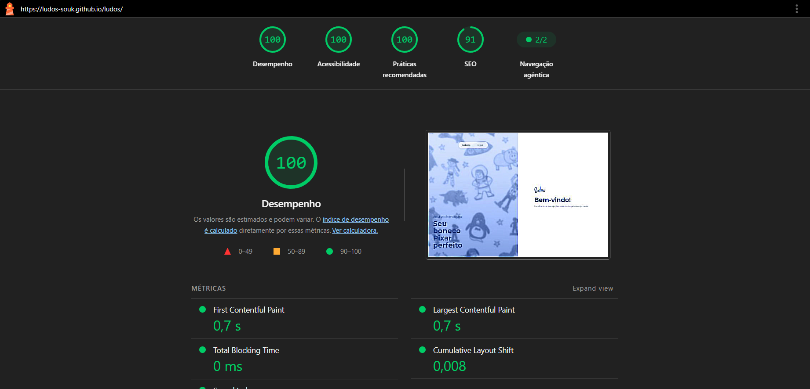
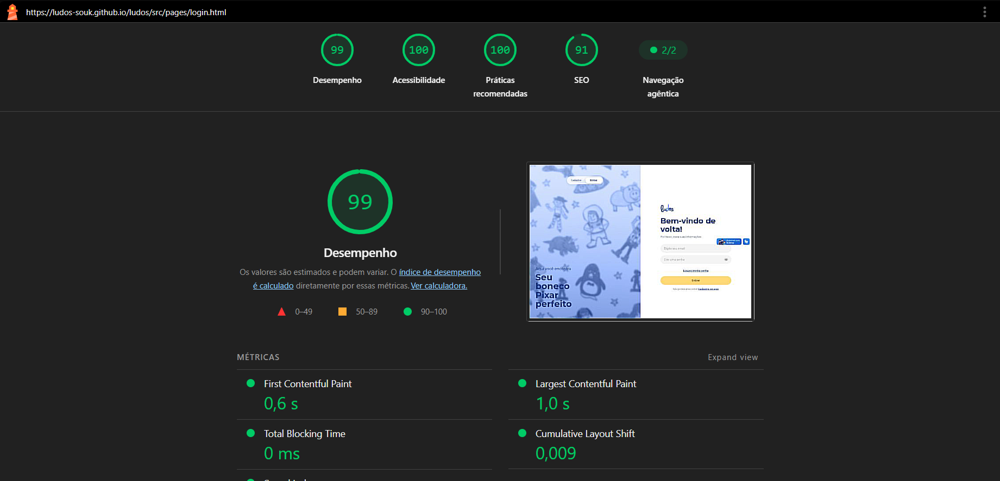
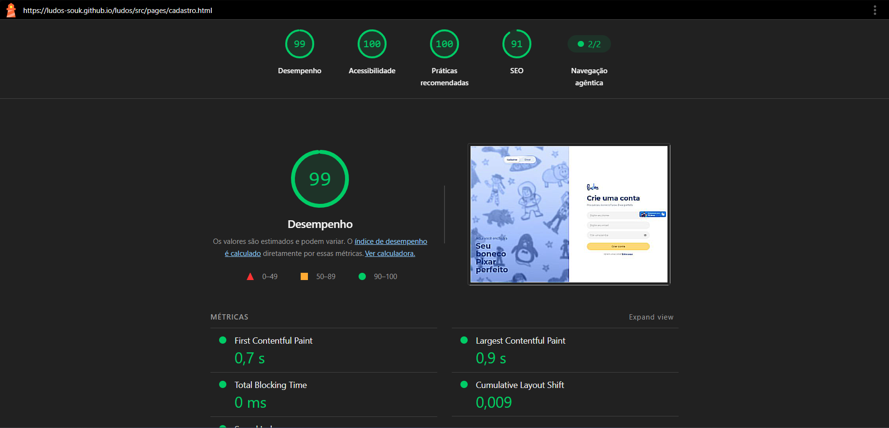
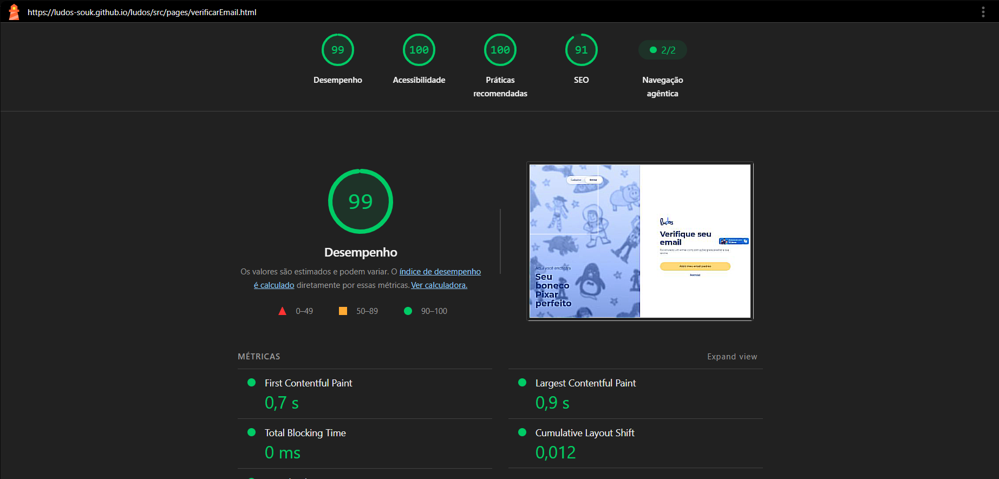

# Relatório de Acessibilidade — Lighthouse

Relatório dos testes de acessibilidade realizados no projeto **Ludos**, desenvolvido para a disciplina de Desenvolvimento de Aplicações Dinâmicas (DAD).

Os testes foram realizados utilizando o **Google Lighthouse**

---

## 1. Metodologia

Os testes foram realizados seguindo as condições definidas no projeto:

- Navegador: Google Chrome;
- Sem extensões instaladas ou ativas;
- Dispositivo: Desktop;

### Critério de interpretação

A pontuação do Lighthouse varia de 0 a 100:

| Pontuação | Classificação |
|---:|---|
| 90–100 | Excelente |
| 50–89 | Necessita melhorias |
| 0–49 | Necessita grandes melhorias |

> A pontuação do Lighthouse é utilizada como indicador automatizado de acessibilidade. Ela não substitui testes manuais, testes com teclado ou testes com tecnologias assistivas.

---

## 2. Páginas avaliadas

As páginas selecionadas para a auditoria foram:

| Página | Rota/Arquivo 
|---|---|---:|
| Index | `index.html` |
| Login | `src/pages/login.html` |
| Cadastro | `src/pages/cadastro.html` |
| Esqueci a senha | `src/pages/esqueciSenha.html` |
| Resetar senha | `src/pages/resetarSenha.html` | 
| Verificar e-mail | `src/pages/verificarEmail.html` | 

---

# 3. Resultados

## 3.1 Index

### Execução 

**Pontuação de acessibilidade:** 100/100

---

## 3.2 Login

### Execução 

**Pontuação de acessibilidade:** 99/100

---

## 3.3 Cadastro

### Execução 

**Pontuação de acessibilidade:** 99/100

---

## 3.4 Esqueci a senha

### Execução 

**Pontuação de acessibilidade:** 99/100

---

## 3.4 Resetar senha

### Execução 

**Pontuação de acessibilidade:** 99/100

---

## 3.5 Verificar e-mail

### Execução 

**Pontuação de acessibilidade:** 99/100

---

# 4. Resumo dos resultados

| Página | Execução |
|---|---:|
| Index | 100 |
| Login | 99 | 
| Cadastro | 99 |
| Esqueci a senha | 99 | 
| Resetar senha | 99 |
| Verificar e-mail | 99 | 

---

# 5. Recursos de acessibilidade implementados

Além dos resultados automatizados do Lighthouse, o projeto implementa recursos de acessibilidade, incluindo:

- HTML semântico;
- Navegação completa por teclado;
- Foco visível em elementos interativos;
- Labels associados aos campos de formulário;
- Textos alternativos para imagens;
- Uso de `aria-label`, `aria-live`, `role` e outros atributos ARIA quando necessários;
- Mensagens de erro e sucesso acessíveis;
- Suporte a conteúdos inseridos dinamicamente;
- Ajuste do tamanho dos textos;
- Fonte alternativa para facilitar a leitura;
- Temas claro e escuro;
- Adaptações para protanopia, deuteranopia e tritanopia;
- Guia visual de leitura;
- Eye tracking;
- Persistência das preferências de acessibilidade;
- Responsividade em diferentes tamanhos de tela.

---

# 6. Considerações sobre os resultados

Os resultados apresentados neste documento representam as auditorias automatizadas realizadas pelo Lighthouse nas condições descritas na metodologia.

Apesar da utilização do Lighthouse, a acessibilidade do projeto também depende de aspectos que não podem ser completamente avaliados por ferramentas automatizadas. Por isso, foram consideradas práticas como navegação por teclado, estrutura semântica, foco visível, textos alternativos e uso adequado de tecnologias assistivas.

---

# 7. Conclusão

Os testes realizados permitiram identificar e verificar aspectos relacionados à acessibilidade das principais páginas da aplicação Ludos.

A auditoria foi utilizada como parte do processo de validação do projeto, auxiliando na identificação de problemas e na aplicação de melhorias na interface e na implementação.

Os resultados completos de cada execução estão apresentados nas imagens deste relatório.